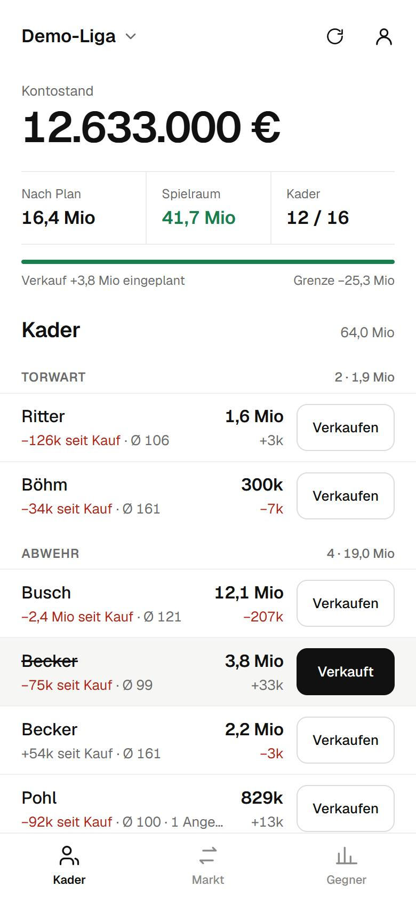
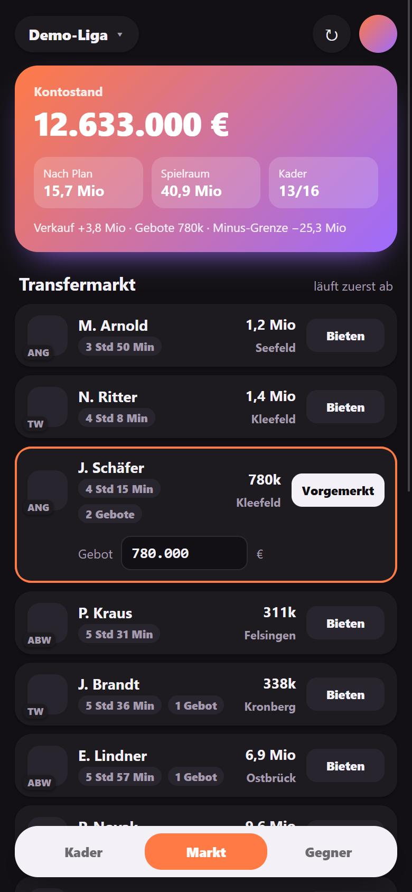
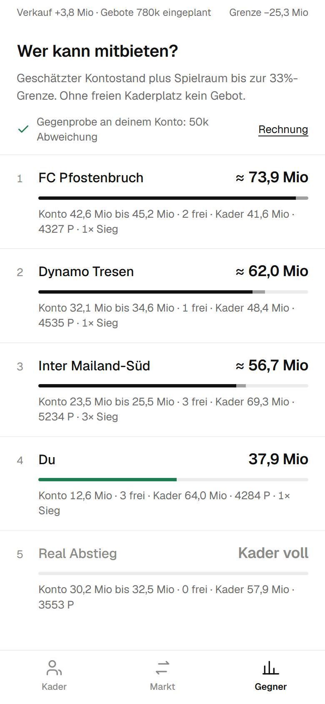
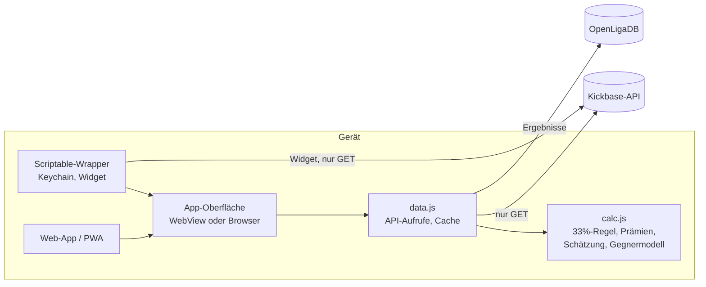

# Kaderplaner für Kickbase

Web-App und iPhone-App (über [Scriptable](https://scriptable.app)) für den
Fußball-Manager Kickbase. Sie zeigt, was die Kickbase-App selbst nicht zeigt: wie
viel Geld die anderen Manager deiner Liga haben und wer bei einem Spieler überhaupt
mitbieten kann.

**[Web-App öffnen](https://azarucha.github.io/Kaderplaner/)** ·
**[Demo ohne Konto](https://azarucha.github.io/Kaderplaner/demo.html)** ·
[Scriptable-Datei](dist/Kaderplaner.js)

> Inoffizielles Hobbyprojekt, nicht mit Kickbase verbunden. Es nutzt die nicht
> dokumentierte Web-Schnittstelle nur lesend und kann jederzeit aufhören zu
> funktionieren, wenn Kickbase daran etwas ändert.

<p align="center">
  
  
  
</p>
<p align="center"><sub>Screenshots aus dem Demo-Modus mit erfundenen Daten.</sub></p>

## Was die App kann

- **Aufstellung planen:** Formation wählen (3-4-3 bis 5-4-1), Spieler aufs Feld
  setzen oder die beste Elf nach Punkteschnitt füllen lassen. Wer auf der Bank sitzt,
  lässt sich mit einem Tipp komplett zum Verkauf vormerken.
- **Ins Plus kommen:** Steht das Konto nach Plan im Minus, schlägt die App vor, wen
  du verkaufen solltest. Sie prüft alle Kombinationen und wählt die, die genug Geld
  bringt und die wenigsten erwarteten Punkte der besten Elf kostet. Erwartete Punkte
  = Qualität (Punkteschnitt und Form der letzten Einsätze) × Gegnerfaktor ×
  Einsatzchance (letzte 5 Spieltage und Saison) × Verfügbarkeit; leere Plätze kosten
  −100. Bei Gleichstand werden schwankende Spieler und fallende Marktwerte zuerst
  verkauft.
- **Gegner der nächsten Spiele:** umschaltbar zwischen nächstem Spiel und den nächsten
  drei (gewichtet 50/30/20). Der Faktor kommt aus der Teamstärke (Ergebnisse dieser und
  der letzten Saison) und daraus, wie viele Kickbase-Punkte ein Gegner Spielern auf
  derselben Position zulässt. In jeder Zeile steht der Gegner, „leicht“ oder „schwer“
  und ob ein Spieler konstant oder schwankend punktet.
- **Kader planen:** Spieler zum Verkauf markieren, Marktspieler mit eigenem Gebot
  vormerken. Kontostand, Spielraum bis zur 33%-Grenze, Kader- und Vereinslimit
  rechnen sofort mit.
- **Transfermarkt:** Restlaufzeit, Anzahl der Gebote, Hinweis wenn ein Spieler erst
  nach dem nächsten Anpfiff zu dir käme, Aufschlag bei Manager-Angeboten.
- **Gegner:** geschätzter Kontostand jedes Managers als Spanne, daraus die
  **Bietkraft** (Kontostand plus Spielraum bis zur 33%-Grenze) und freie
  Kaderplätze. Wer keinen Platz frei hat, kann nicht mitbieten.
- **Homescreen-Widget:** Kontostand, Spielraum, nächster Anpfiff und die
  Marktspieler, deren Angebot als Nächstes ausläuft.
- Hell- und Dunkelmodus, mehrere Ligen, der Token liegt in der iOS-Keychain.

## Die eigentliche Aufgabe: Kontostände rekonstruieren

Kickbase zeigt dir nur deinen eigenen Kontostand. Für jede Gebotsentscheidung ist
aber entscheidend, was die anderen bieten *können*. Die App rechnet die Kontostände
deshalb aus öffentlich abrufbaren Daten nach:

```
Kontostand = Startbudget
           − Käufe + Verkäufe           (komplette Transferhistorie pro Manager)
           + MVP-Auto-Verkäufe
           + Punkteprämie               (1.000 € je Saisonpunkt in der 2. Liga)
           + Erfolgsprämien             (Spieltagssiege, Punkteschwellen, starke
                                         Spieler, Transfers, Gewinne pro Spieler)
           + tägliche Auflaufprämie     (Staffel bis 50k bzw. 100k pro Tag)
```

**Prüfstein:** Dieselbe Rechnung wird auf das eigene Konto angewendet, dessen echten
Stand die API liefert. In einer echten Liga mit rund 960 Mio € Transfervolumen lag
die Abweichung bei **50.000 €**. Die App zeigt diese Gegenprobe bei jeder Berechnung
an, damit man sieht, wie belastbar die Gegnerwerte gerade sind.

Unterwegs gefunden und dokumentiert ([docs/kickbase-api-notes.md](docs/kickbase-api-notes.md)):

- Der Aktivitäten-Feed reicht nur etwa einen Monat zurück. Wer Transfers nur daraus
  liest, verliert alles Ältere. Die erste Version der App hat das unbemerkt mit
  einem Korrekturbetrag von −67 Mio „ausgeglichen“ und Gegner um bis zu 20 Mio
  falsch geschätzt. Die vollständige Historie gibt es pro Manager über einen
  anderen Endpunkt.
- Der Teamwert in der Rangliste ist nur der Wert der Aufstellung, nicht des Kaders.
- Die Erfolgsprämien sind nirgends pro Gegner abrufbar, lassen sich aber aus
  Spieltags-, Spieler- und Transferdaten exakt ableiten. Für das eigene Konto stimmt
  die Ableitung auf den Euro mit den von Kickbase gemeldeten Erfolgen überein.

## Hilft der Gegner wirklich bei der Vorhersage?

Ja, aber weniger, als man denkt. Rückgerechnet an 475 Spielern der 2. Liga (4.644
Startelf-Einsätze, jeder Spieltag nur mit den Daten davor vorhergesagt, Skript
[`tools/backtest.mjs`](tools/backtest.mjs)):

| Vorhersage | mittlerer Fehler (RMSE) |
|---|---|
| Saisonschnitt des Spielers | 63,7 Punkte |
| Schnitt × Gegnerfaktor | **63,2 Punkte** |

Der Unterschied ist klein, aber deutlich größer als der Zufall (rund vier
Standardfehler). Kickbase-Punkte schwanken pro Spiel enorm; selbst mit den tatsächlichen
Ergebnissen im Nachhinein käme man nur auf 62,3. Zwei Ideen haben die Vorhersage dagegen
**nicht** verbessert und sind deshalb nicht drin: ein getrimmter Schnitt ohne
Ausreißerspiele und ein eigener Gegnereffekt pro Spieler. Konstanz zeigt die App an und
nutzt sie bei Gleichstand, an den Punkten ändert sie nichts.

Grenzen: Früh in der Saison und bei Aufsteigern gibt es wenige Spiele, die Werte werden
dann zum Mittel gezogen. Pokal- und Europapokalspiele zählen nicht.

## Installation

### Als Web-App

[azarucha.github.io/Kaderplaner](https://azarucha.github.io/Kaderplaner/) ist eine
statische Web-App (PWA) ohne Server-Anteil: Login mit Kickbase-E-Mail und Passwort,
das Passwort geht direkt an Kickbase und wird nicht gespeichert. Auf dem iPhone in
Safari öffnen und über *Teilen → Zum Home-Bildschirm* installieren. Unter
[`demo.html`](https://azarucha.github.io/Kaderplaner/demo.html) läuft dieselbe App
mit erfundenen Daten, ganz ohne Kickbase-Konto. Gebaut wird sie aus `dist/web/` bei
jedem Push auf `main`.

### Als Scriptable-App mit Widget

1. [Scriptable](https://apps.apple.com/app/scriptable/id1405459188) aus dem App Store
   installieren.
2. [`dist/Kaderplaner.js`](dist/Kaderplaner.js) in den Scriptable-Ordner in iCloud
   Drive legen (oder in Scriptable ein neues Skript anlegen und den Inhalt einfügen).
3. Skript starten und mit E-Mail und Passwort anmelden (oder einen Token einfügen).
   Der Token liegt danach in der iOS-Keychain. Er läuft nach einigen Tagen ab,
   dann fragt die App erneut.

**Widget:** Auf dem Homescreen ein Scriptable-Widget hinzufügen, als Skript
„Kaderplaner“ wählen. Klein, Mittel und Groß werden unterstützt. Im Feld
*Parameter* kannst du einen Liganamen oder eine Liga-ID eintragen; ohne Angabe zeigt
das Widget die zuletzt in der App geöffnete Liga.

## Aufbau



| Datei | Inhalt |
|---|---|
| `src/calc.js` | Reine Rechenfunktionen ohne DOM und Netzwerk, getestet in `test/` |
| `src/data.js` | Lädt Transfers, Spieltage, Spielerpunkte und Prämien, rechnet die Schätzung |
| `src/app.js`, `src/index.html`, `src/styles.css` | Oberfläche |
| `scriptable/wrapper.js` | Scriptable-Hülle: Keychain, Widget, Brücke zur WebView |
| `web/` | Manifest, Service Worker und Icons der Web-App |
| `build.mjs` | Bündelt alles zu `dist/Kaderplaner.js` (Scriptable) und `dist/web/` (PWA) |
| `tools/mock.js` | Simuliertes Kickbase-Backend mit erfundenen Daten für Demo und Tests |
| `tools/widget-harness.mjs` | Führt das Widget in Node mit nachgebildeten Scriptable-APIs aus |
| `tools/backtest.mjs` | Rückrechnung des Gegnermodells auf einem lokalen Datenexport (`tools/collect.html`) |

## Entwicklung

Voraussetzung ist Node.js 22 oder neuer, weitere Abhängigkeiten gibt es nicht.

```bash
npm test          # Rechenlogik gegen anonymisierte Messwerte einer echten Liga
npm run build     # dist/Kaderplaner.js und die Web-App in dist/web/
npm run demo      # Web-App auf http://localhost:8787 (Demo unter demo.html)
npm run widget    # Widget-Aufbau gegen das Demo-Backend ausgeben
npm run deploy    # bauen und in den iCloud-Scriptable-Ordner kopieren
```

## Entstehung

Das Projekt ist mit [Claude Code](https://claude.com/claude-code) entstanden: von der
ersten Version über das Nachvollziehen der Prämienlogik an Live-Daten bis zu Tests,
Demo-Backend und Widget. Die Schätzformel wurde nicht geraten, sondern Schritt für
Schritt gegen den echten Kontostand geprüft, bis die Abweichung im Rauschen lag.

## Hinweise

- Inoffizielles Projekt, nicht mit Kickbase verbunden. Es nutzt die nicht
  dokumentierte Web-API, die sich jederzeit ändern kann. Es gibt keinen Support und
  keine Zusagen für neue Funktionen.
- Die App **liest nur**. Sie gibt keine Gebote ab, verkauft nichts und ändert keine
  Aufstellung.
- Die Gegnerwerte sind Schätzungen. Unsicher bleiben vor allem die Auflaufprämie
  (loggt jemand täglich ein?) und ältere Mannschaftswert-Erfolge.

## Datenschutz

- Es gibt keinen eigenen Server, kein Tracking und keine Werbung. Die App ist eine
  statische Seite, die direkt im Browser mit `api.kickbase.com` (und für Ergebnisse
  mit `api.openligadb.de`) spricht.
- E-Mail und Passwort gehen beim Anmelden nur an Kickbase und werden nicht
  gespeichert. Auf dem Gerät bleibt nur der Zugangstoken (im Browser-Speicher bzw.
  in der iOS-Keychain), bis du dich abmeldest.
- Die Schrift [Geist](https://github.com/vercel/geist-font) wird mitgeliefert
  (SIL Open Font License), Schriften oder Skripte von Drittservern werden nicht
  nachgeladen.
- Für den Gegnerfaktor holt die App öffentliche Spielergebnisse von
  [OpenLigaDB](https://www.openligadb.de) (`api.openligadb.de`, ohne Login und Cookies).
  Dabei sieht OpenLigaDB wie jeder Server deine IP-Adresse; Kickbase-Daten oder dein
  Token gehen nicht dorthin. Ist OpenLigaDB nicht erreichbar, rechnet die App mit den
  Ergebnissen aus den Kickbase-Daten.
- Die Web-Version liegt auf GitHub Pages; dort gilt das
  [GitHub Privacy Statement](https://docs.github.com/site-policy/privacy-policies/github-general-privacy-statement).

## Unterstützen

Der Kaderplaner ist kostenlos und bleibt es. Wenn er dir beim Bieten hilft, freue ich
mich über einen Kaffee auf [Ko-fi](https://ko-fi.com/azarucha).

## Lizenz

[MIT](LICENSE)
