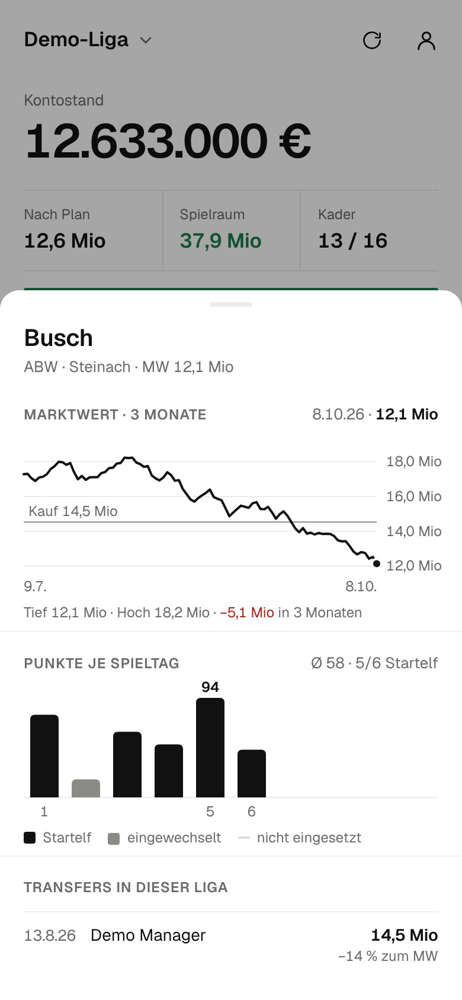
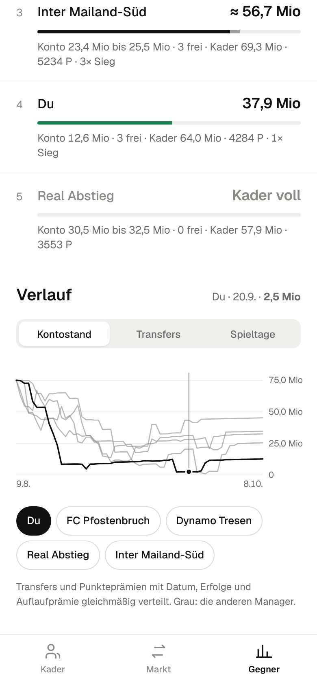
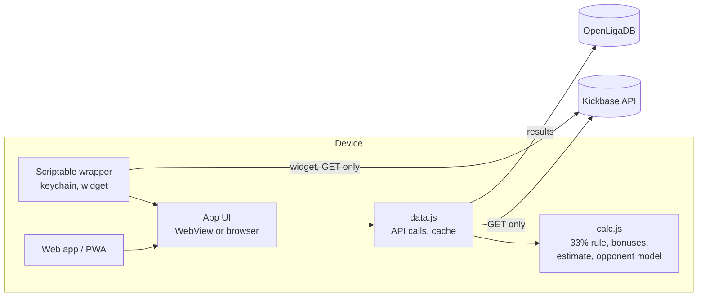

# Kaderplaner for Kickbase

**English** · [Deutsch](README.de.md)

A web app and iPhone app (via [Scriptable](https://scriptable.app)) for the fantasy
football game Kickbase. It shows what the Kickbase app keeps to itself: how much money
the other managers in your league have, and who can actually afford to bid on a player.

**[Open the web app](https://azarucha.github.io/Kaderplaner/)** ·
**[Demo without an account](https://azarucha.github.io/Kaderplaner/demo.html)** ·
[Scriptable file](dist/Kaderplaner.js)

The app itself is in German. It works for Bundesliga and 2. Bundesliga leagues.

> Unofficial hobby project, not affiliated with Kickbase. It only reads from the
> undocumented web API, so it can break any day if Kickbase changes something.

<p align="center">
  
  
  
</p>
<p align="center">
  
  
</p>
<p align="center"><sub>Screenshots from demo mode with made-up data.</sub></p>

## What it does

- **Plan your lineup.** It picks up your current Kickbase lineup, lets you choose a
  formation from 3-4-3 to 5-4-1, and you can swap players in with a tap or let it fill
  the best eleven by expected points. Sell someone and the next best player moves up.
  If a spot is empty, it lists the best fitting players on the market.
- **Get out of the red.** If your planned balance ends up negative, the app tells you
  who to sell. It checks every combination and picks the one that raises enough money
  while costing your best eleven the fewest expected points. Expected points are
  quality (points average and recent form) × opponent factor × chance of playing (last
  5 matchdays and the season) × availability. An empty spot counts as −100. On a tie it
  sells the streaky players and falling market values first.
- **See if a buy is worth it.** For every player on the market the app works out how
  many expected points per matchday your best eleven would gain. If you can't afford
  him, it says right away who you'd have to sell, and it only recommends deals that
  add points overall. One tap notes the bid and the sales and rearranges your eleven.
- **Upcoming opponents.** Switch between the next match and the next three (weighted
  50/30/20). The factor comes from team strength (results this season and last) and
  from how many Kickbase points an opponent gives up to players in the same position.
  Each row shows the opponent, whether it's an easy or hard game, and whether the
  player scores consistently or swings a lot.
- **Plan your squad.** Mark players for sale and note market players with your own
  bid. Balance, room left until the 33% limit, squad size and the per-club limit
  update immediately.
- **Transfer market.** Time left, number of bids, a note when a player would only join
  you after the next kickoff, and the markup on offers from other managers.
- **Rivals.** An estimated balance for every manager, shown as a range. From that comes
  their **bidding power** (balance plus room until the 33% limit) and how many squad
  spots they have free. Someone with a full squad can't bid at all.
- **Player details.** Tap a player to see his market value over the last three
  months (with your purchase price), his points per matchday split into starts and
  sub appearances, and who paid what for him in your league.
- **Bidding help.** Once you note a bid, the app shows how far above market value
  your league has paid over the last 45 days, which rivals can afford to join in and
  what they usually pay, and a suggested bid that would have beaten three out of four
  of those purchases.
- **Season history.** Every manager's balance over the season, profit from sold
  players, and a points table per matchday. Managers who look inactive (no transfer
  for 21 days, no points on the last matchday) can be hidden.
- **Home screen widget.** Balance, room to spend, next kickoff and the market players
  whose listing ends next.
- Light and dark mode, multiple leagues, and the token is stored in the iOS keychain.

## The real work: rebuilding everyone's balance

Kickbase only shows you your own balance. But for every bid, what matters is what the
others *can* pay. So the app recalculates their balances from data anyone in the
league can fetch:

```
balance = starting budget
        − purchases + sales           (full transfer history per manager)
        + MVP auto-sales
        + points bonus                (€1,000 per season point in the 2. Bundesliga)
        + achievement bonuses         (matchday wins, point thresholds, strong
                                       players, transfers, profit per player)
        + daily login bonus           (scales up to 50k or 100k per day)
```

**The check:** the same calculation runs on your own account, whose real balance the
API does return. In a real league with about €960 million in transfer volume it was
off by **€50,000**. The app shows this cross-check every time it calculates, so you can
see how far to trust the rival numbers on that day.

Things I found along the way, written up in
[docs/kickbase-api-notes.md](docs/kickbase-api-notes.md) (German):

- The activity feed only goes back about a month. If you read transfers from it alone,
  you lose everything older. The first version of the app quietly "fixed" that with a
  −67 million correction and got rivals wrong by up to 20 million. The full history is
  available per manager through a different endpoint.
- The team value in the league ranking is only the value of the lineup, not of the
  whole squad.
- Achievement bonuses can't be fetched for other managers, but they can be derived
  exactly from matchday, player and transfer data. For my own account the derived
  amount matches what Kickbase reports, down to the euro.

## Does the opponent really help the prediction?

Yes, but less than you'd think. I tested it on 475 players from the 2. Bundesliga (4,644
starts, each matchday predicted only from the data available before it, script
[`tools/backtest.mjs`](tools/backtest.mjs)):

| Prediction | mean error (RMSE) |
|---|---|
| player's season average | 63.7 points |
| average × opponent factor | **63.2 points** |

The gap is small, but well beyond chance (about four standard errors). Kickbase points
swing wildly from game to game; even knowing the actual results afterwards only gets
you to 62.3. Two ideas did **not** improve the prediction, so they're not in the app:
a trimmed average without outlier games, and a separate opponent effect per player.
The app shows consistency and uses it to break ties, but it doesn't change the points.

Limits: early in the season and for newly promoted teams there are only a few games, so
the values get pulled toward the average. Cup and European games don't count.

## Installation

### As a web app

[azarucha.github.io/Kaderplaner](https://azarucha.github.io/Kaderplaner/) is a static
web app (PWA) with no server of its own. You log in with your Kickbase email and
password; the password goes straight to Kickbase and isn't stored. On the iPhone, open
it in Safari and use *Share → Add to Home Screen*. The same app runs with made-up data
at [`demo.html`](https://azarucha.github.io/Kaderplaner/demo.html), no Kickbase account
needed. It's built from `dist/web/` on every push to `main`.

### As a Scriptable app with widget

1. Install [Scriptable](https://apps.apple.com/app/scriptable/id1405459188) from the
   App Store.
2. Put [`dist/Kaderplaner.js`](dist/Kaderplaner.js) into the Scriptable folder in
   iCloud Drive (or create a new script in Scriptable and paste the contents).
3. Run the script and log in with email and password (or paste a token). The token is
   then kept in the iOS keychain. It expires after a few days and the app asks again.

**Widget:** add a Scriptable widget to your home screen and pick "Kaderplaner" as the
script. Small, medium and large sizes work. In the *Parameter* field you can enter a
league name or league ID; if you leave it empty, the widget shows the league you last
opened in the app.

## How it's built



| File | Contents |
|---|---|
| `src/calc.js` | Pure calculation functions without DOM or network, tested in `test/` |
| `src/charts.js` | Small SVG charts without a library, colored only through the CSS tokens |
| `src/data.js` | Loads transfers, matchdays, player points and bonuses, runs the estimate |
| `src/app.js`, `src/index.html`, `src/styles.css` | User interface |
| `scriptable/wrapper.js` | Scriptable shell: keychain, widget, bridge to the WebView |
| `web/` | Manifest, service worker and icons for the web app |
| `build.mjs` | Bundles everything into `dist/Kaderplaner.js` (Scriptable) and `dist/web/` (PWA) |
| `tools/mock.js` | Simulated Kickbase backend with made-up data for the demo and tests |
| `tools/widget-harness.mjs` | Runs the widget in Node against stand-ins for the Scriptable APIs |
| `tools/backtest.mjs` | Backtest of the opponent model on a local data export (`tools/collect.html`) |

## Development

You need Node.js 22 or newer. There are no other dependencies.

```bash
npm test          # calculation logic against anonymized data from a real league
npm run build     # dist/Kaderplaner.js and the web app in dist/web/
npm run demo      # web app on http://localhost:8787 (demo at demo.html)
npm run widget    # print the widget layout against the demo backend
npm run deploy    # build and copy into the iCloud Scriptable folder
```

## How it came about

I built this with [Claude Code](https://claude.com/claude-code), from the first version
through working out the bonus rules against live data to the tests, the demo backend and
the widget. The balance formula wasn't guessed. It was checked step by step against my
real balance until the difference was down in the noise.

## Notes

- Unofficial project, not affiliated with Kickbase. It uses the undocumented web API,
  which can change at any time. There's no support and no promise of new features.
- The app **only reads**. It never places bids, sells players or changes your lineup.
- Rival values are estimates. The two shakiest parts are the daily login bonus (does
  someone log in every day?) and older team value achievements.

## Privacy

- There's no server of my own, no tracking and no ads. The app is a static page that
  talks to `api.kickbase.com` straight from your browser (and to `api.openligadb.de`
  for match results).
- When you log in, your email and password go only to Kickbase and aren't stored. The
  only thing kept on your device is the access token (in browser storage or the iOS
  keychain) until you log out.
- The [Geist](https://github.com/vercel/geist-font) font ships with the app (SIL Open
  Font License). No fonts or scripts are loaded from third-party servers.
- For the opponent factor the app fetches public match results from
  [OpenLigaDB](https://www.openligadb.de) (`api.openligadb.de`, no login, no cookies).
  Like any server, OpenLigaDB sees your IP address; your Kickbase data and token are
  never sent there. If OpenLigaDB is down, the app falls back to results from the
  Kickbase data.
- The web version is hosted on GitHub Pages, where the
  [GitHub Privacy Statement](https://docs.github.com/site-policy/privacy-policies/github-general-privacy-statement)
  applies.

## Support

Kaderplaner is free and will stay that way. If it helps you win a bid, I'd be happy
about a coffee on [Ko-fi](https://ko-fi.com/azarucha).

## License

[MIT](LICENSE)
