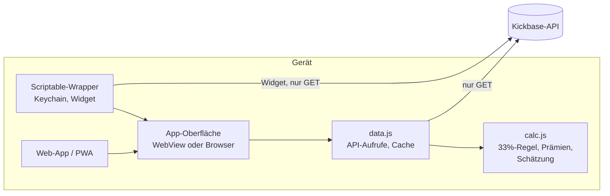

# Kaderplaner für Kickbase

Eine iPhone-App (über [Scriptable](https://scriptable.app)) für den Fußball-Manager
[Kickbase](https://www.kickbase.com). Sie zeigt, was die Kickbase-App selbst nicht
zeigt: wie viel Geld die anderen Manager deiner Liga haben und wer bei einem Spieler
überhaupt mitbieten kann.

<p align="center">
  
  
  
</p>
<p align="center"><sub>Screenshots aus dem Demo-Modus mit erfundenen Daten.</sub></p>

## Was die App kann

- **Kader planen:** Spieler zum Verkauf markieren, Marktspieler mit eigenem Gebot
  vormerken. Kontostand, Spielraum bis zur 33%-Grenze, Kader- und Vereinslimit
  rechnen sofort mit.
- **Transfermarkt:** Restlaufzeit, Anzahl der Gebote, Hinweis wenn ein Spieler erst
  nach dem nächsten Anpfiff zu dir käme, Aufschlag bei Manager-Angeboten.
- **Gegner:** geschätzter Kontostand jedes Managers als Spanne, daraus die
  **Bietkraft** (Kontostand plus Spielraum bis zur 33%-Grenze) und freie
  Kaderplätze. Wer keinen Platz frei hat, kann nicht mitbieten.
- **Homescreen-Widget:** Kontostand, Spielraum, nächster Anpfiff und die
  Marktspieler, deren Angebot als Nächstes ausläuft.
- Hell- und Dunkelmodus, mehrere Ligen, der Token liegt in der iOS-Keychain.

## Die eigentliche Aufgabe: Kontostände rekonstruieren

Kickbase zeigt dir nur deinen eigenen Kontostand. Für jede Gebotsentscheidung ist
aber entscheidend, was die anderen bieten *können*. Die App rechnet die Kontostände
deshalb aus öffentlich abrufbaren Daten nach:

```
Kontostand = Startbudget
           − Käufe + Verkäufe           (komplette Transferhistorie pro Manager)
           + MVP-Auto-Verkäufe
           + Punkteprämie               (1.000 € je Saisonpunkt in der 2. Liga)
           + Erfolgsprämien             (Spieltagssiege, Punkteschwellen, starke
                                         Spieler, Transfers, Gewinne pro Spieler)
           + tägliche Auflaufprämie     (Staffel bis 50k bzw. 100k pro Tag)
```

**Prüfstein:** Dieselbe Rechnung wird auf das eigene Konto angewendet, dessen echten
Stand die API liefert. In einer echten Liga mit rund 960 Mio € Transfervolumen lag
die Abweichung bei **50.000 €**. Die App zeigt diese Gegenprobe bei jeder Berechnung
an, damit man sieht, wie belastbar die Gegnerwerte gerade sind.

Unterwegs gefunden und dokumentiert ([docs/kickbase-api-notes.md](docs/kickbase-api-notes.md)):

- Der Aktivitäten-Feed reicht nur etwa einen Monat zurück. Wer Transfers nur daraus
  liest, verliert alles Ältere. Die erste Version der App hat das unbemerkt mit
  einem Korrekturbetrag von −67 Mio „ausgeglichen“ und Gegner um bis zu 20 Mio
  falsch geschätzt. Die vollständige Historie gibt es pro Manager über einen
  anderen Endpunkt.
- Der Teamwert in der Rangliste ist nur der Wert der Aufstellung, nicht des Kaders.
- Die Erfolgsprämien sind nirgends pro Gegner abrufbar, lassen sich aber aus
  Spieltags-, Spieler- und Transferdaten exakt ableiten. Für das eigene Konto stimmt
  die Ableitung auf den Euro mit den von Kickbase gemeldeten Erfolgen überein.

## Installation

### Als Web-App

`dist/web/` ist eine statische Web-App (PWA) ohne Server-Anteil: Login mit
Kickbase-E-Mail und Passwort, das Passwort geht direkt an Kickbase und wird nicht
gespeichert. Auf dem iPhone in Safari öffnen und über *Teilen → Zum Home-Bildschirm*
installieren. Unter `demo.html` läuft dieselbe App mit erfundenen Daten, ganz ohne
Kickbase-Konto.

### Als Scriptable-App mit Widget

1. [Scriptable](https://apps.apple.com/app/scriptable/id1405459188) aus dem App Store
   installieren.
2. [`dist/Kaderplaner.js`](dist/Kaderplaner.js) in den Scriptable-Ordner in iCloud
   Drive legen (oder in Scriptable ein neues Skript anlegen und den Inhalt einfügen).
3. Skript starten und mit E-Mail und Passwort anmelden (oder einen Token einfügen).
   Der Token liegt danach in der iOS-Keychain. Er läuft nach einigen Tagen ab,
   dann fragt die App erneut.

**Widget:** Auf dem Homescreen ein Scriptable-Widget hinzufügen, als Skript
„Kaderplaner“ wählen. Klein, Mittel und Groß werden unterstützt. Im Feld
*Parameter* kannst du einen Liganamen oder eine Liga-ID eintragen; ohne Angabe zeigt
das Widget die zuletzt in der App geöffnete Liga.

## Aufbau



| Datei | Inhalt |
|---|---|
| `src/calc.js` | Reine Rechenfunktionen ohne DOM und Netzwerk, getestet in `test/` |
| `src/data.js` | Lädt Transfers, Spieltage, Spielerpunkte und Prämien, rechnet die Schätzung |
| `src/app.js`, `src/index.html`, `src/styles.css` | Oberfläche |
| `scriptable/wrapper.js` | Scriptable-Hülle: Keychain, Widget, Brücke zur WebView |
| `web/` | Manifest, Service Worker und Icons der Web-App |
| `build.mjs` | Bündelt alles zu `dist/Kaderplaner.js` (Scriptable) und `dist/web/` (PWA) |
| `tools/mock.js` | Simuliertes Kickbase-Backend mit erfundenen Daten für Demo und Tests |
| `tools/widget-harness.mjs` | Führt das Widget in Node mit nachgebildeten Scriptable-APIs aus |

## Entwicklung

Voraussetzung ist Node.js 22 oder neuer, weitere Abhängigkeiten gibt es nicht.

```bash
npm test          # Rechenlogik gegen anonymisierte Messwerte einer echten Liga
npm run build     # dist/Kaderplaner.js und die Web-App in dist/web/
npm run demo      # Web-App auf http://localhost:8787 (Demo unter demo.html)
npm run widget    # Widget-Aufbau gegen das Demo-Backend ausgeben
npm run deploy    # bauen und in den iCloud-Scriptable-Ordner kopieren
```

## Entstehung

Das Projekt ist mit [Claude Code](https://claude.com/claude-code) entstanden: von der
ersten Version über das Nachvollziehen der Prämienlogik an Live-Daten bis zu Tests,
Demo-Backend und Widget. Die Schätzformel wurde nicht geraten, sondern Schritt für
Schritt gegen den echten Kontostand geprüft, bis die Abweichung im Rauschen lag.

## Hinweise

- Inoffizielles Projekt, nicht mit Kickbase verbunden. Es nutzt die nicht
  dokumentierte Web-API, die sich jederzeit ändern kann.
- Die App **liest nur**. Sie gibt keine Gebote ab, verkauft nichts und ändert keine
  Aufstellung.
- Der Token bleibt auf dem Gerät (iOS-Keychain) und wird ausschließlich an
  `api.kickbase.com` gesendet.
- Die Gegnerwerte sind Schätzungen. Unsicher bleiben vor allem die Auflaufprämie
  (loggt jemand täglich ein?) und ältere Mannschaftswert-Erfolge.

## Lizenz

[MIT](LICENSE)
